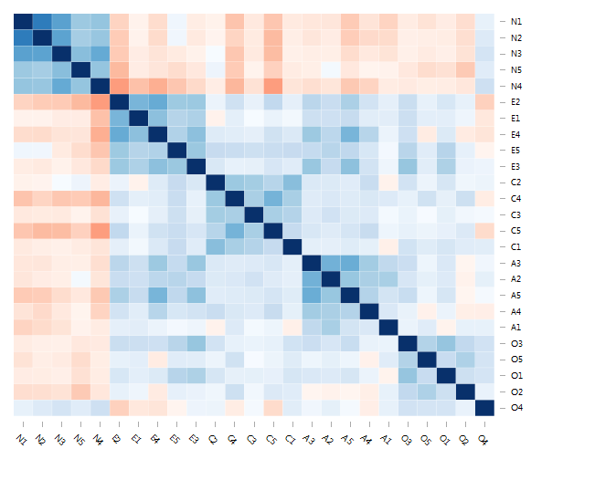

# heatR


#### Visualizing correlation matrix structure

"Don't let yourself get attached to anything you are not willing to walk out on in 30 seconds flat if you feel the **heat** around the corner." ~ Neil McCauley

I've decided to fork a function from a [personal package](https://github.com/m-clark/lazerhawk) into it's own package for possible further expansion, and allow clients and collaborators to easily use. It's pretty raw in some sense but already feasible.  I work a lot with psychometric and similar data for which multiple variables are assumed to have an underlying structure, and would like to see some of the structure (assuming it exists) before I get too deep into modeling.  More to the point, looking at a square mass of numbers is not very enlightening on its own usually.

Similar to how even the base R `heatmap` function will create a visualization of matrix values ordered based on a cluster analysis, this is specifically suited to a correlation matrix, which is reordered based on an underlying latent variable model. It uses the `fa` function from the **psych** package, and if you want to do some of the rotations, you'll also need the **GPArotation** package.  Technically you have the choice to use base R's `factanal`, but I'll be removing that at some point.

Note that this is not for doing factor analysis and visualizing the results. The analysis is only a quick and dirty, but apt, way to provide the ordering to add structure in visualizing correlation matrix, which is something one should do *before* analysis.  While you can play with some modeling options, the number of factors is chosen so that the factor analysis will actually run.  Even then, a poor correlation matrix and/or the right combo of options might get you an error.  However, I've used it often on a variety of data sets and the defaults seem to work fine.  In addition, the psych package provides functionality to produce a correlation matrix for binary and ordinal data.

The interactive visualization produced is based on [d3heatmap](https://github.com/rstudio/d3heatmap).  The coloring is fixed for now (blue for positive correlation, red negative, fade to white as you go to zero), though that may change in the future. Other static options include the **psych** package's own `corr.plot` function as well as the **corrplot** package, though they are limited in different ways for my needs, hence this thing.


To install:

```r
devtools::install_github('m-clark/heatR')
```

To use:

```r
library(heatR)
data(bfi)
cormat = cor(bfi, use='pair')
corrheat(cormat, psychOptions = list(fm='ml', rotate='promax'))
```



